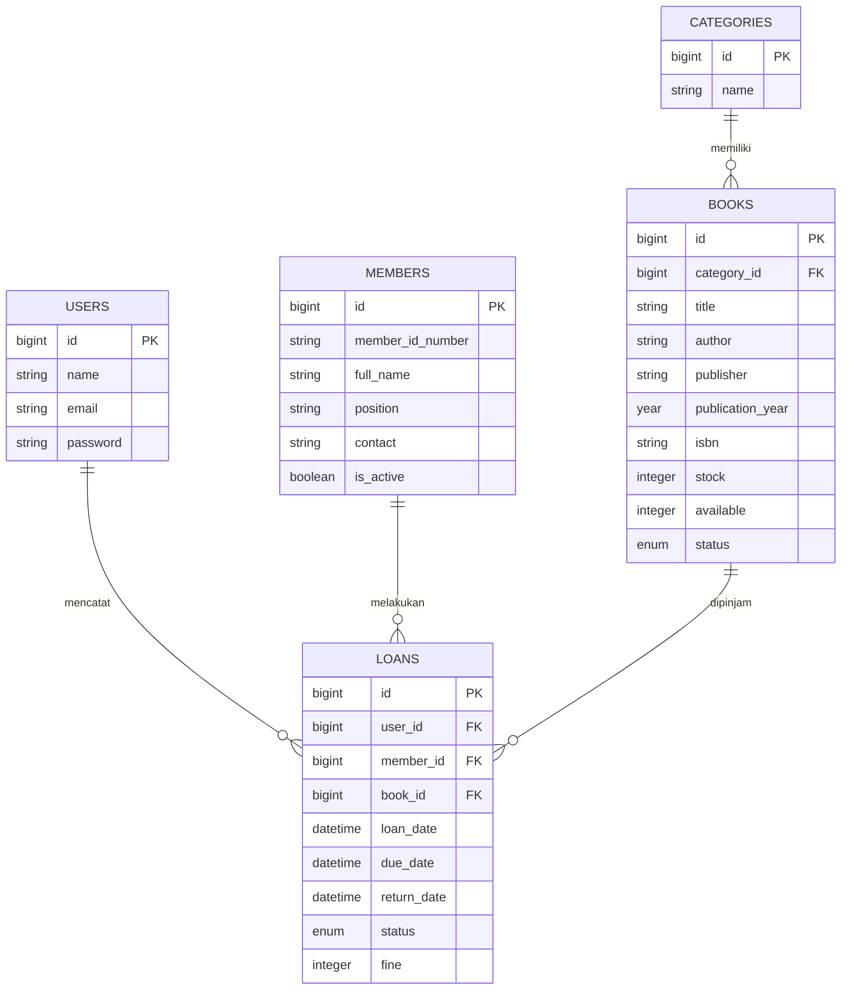
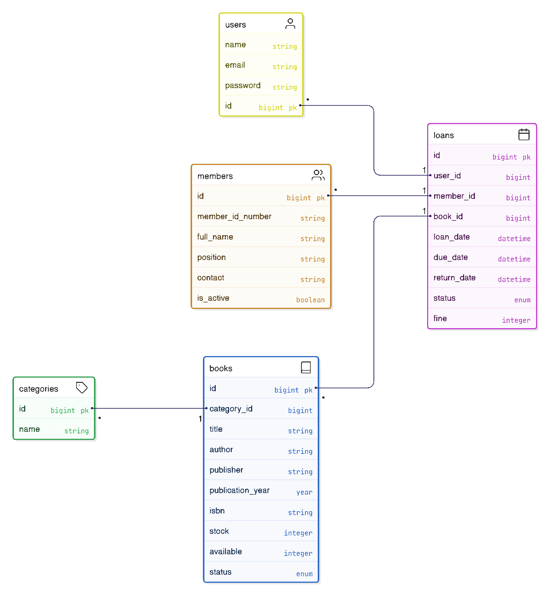
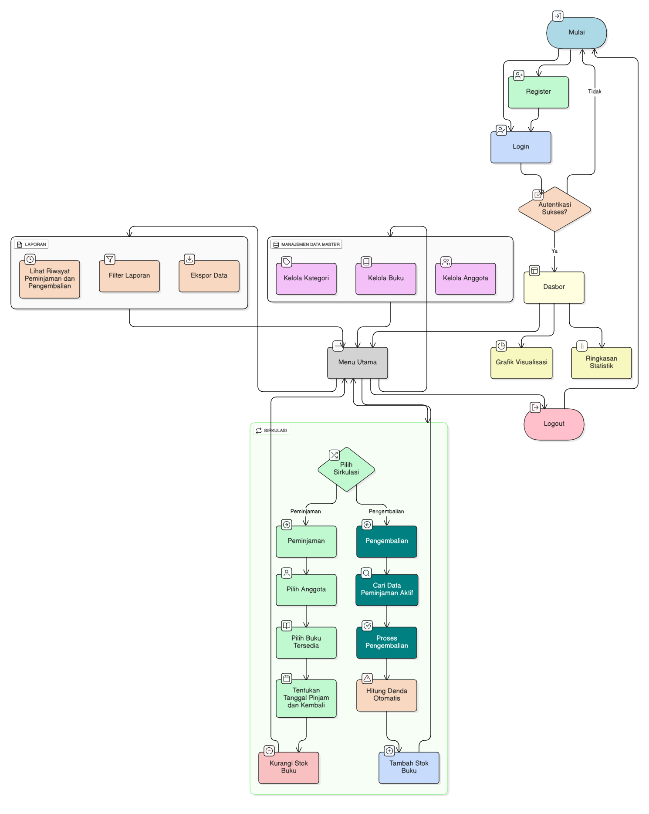

# Gelora Library

Aplikasi web modern untuk mengelola operasional perpustakaan, mulai dari manajemen buku, anggota, sirkulasi peminjaman, hingga pelaporan.

## 👨‍💻 Tim Pengembang

**Software Engineer Lead**
*   **Nama**: Eka Revandi
*   **Role**: Full Stack Developer & System Architect

## 🛠️ Tech Stack

Aplikasi ini dibangun menggunakan teknologi modern untuk memastikan performa, keamanan, dan kemudahan pengembangan.

### Backend
*   **Framework**: [Laravel 11](https://laravel.com) - Framework PHP yang robust dan ekspresif.
*   **Database**: SQLite (Development) / MySQL (Production Ready) - Penyimpanan data relasional.

### Frontend
*   **Templating**: Blade - Templating engine bawaan Laravel.
*   **Styling**: [Tailwind CSS](https://tailwindcss.com) - Framework CSS utility-first untuk desain modern dan responsif.
*   **Interactivity**: [Alpine.js](https://alpinejs.dev) - Framework JavaScript ringan untuk interaksi UI (seperti dropdown, modal, sidebar).
*   **Charts**: [Chart.js](https://www.chartjs.org) - Visualisasi data statistik.

## 🏗️ Arsitektur Aplikasi

Aplikasi ini menggunakan pola arsitektur **MVC (Model-View-Controller)** yang memisahkan logika bisnis, tampilan, dan data.

*   **Model**: Merepresentasikan struktur data dan logika bisnis (Eloquent ORM).
*   **View**: Menangani tampilan antarmuka pengguna (Blade Templates).
*   **Controller**: Menghubungkan Model dan View, memproses permintaan pengguna.

### Alur Data
1.  **Request**: Pengguna mengirim permintaan melalui browser (misal: membuka halaman dasbor).
2.  **Route**: Laravel mengarahkan permintaan ke Controller yang sesuai.
3.  **Controller**: Meminta data dari Model atau memproses logika bisnis.
4.  **Model**: Berinteraksi dengan Database untuk mengambil/menyimpan data.
5.  **View**: Controller mengirimkan data ke View untuk dirender menjadi HTML.
6.  **Response**: HTML dikirim kembali ke browser pengguna.

## 🗂️ Skema Database (ERD)

Berikut adalah diagram hubungan antar entitas (Entity Relationship Diagram) dalam sistem ini:

## 🔄 Alur Aplikasi (User Flow)

### 1. Autentikasi
*   Pengguna (Admin/Pustakawan) harus **Login** terlebih dahulu untuk mengakses sistem.
*   Tersedia fitur **Register** untuk mendaftarkan akun admin baru.

### 2. Dasbor (Dashboard)
*   Setelah login, pengguna diarahkan ke **Dasbor**.
*   Menampilkan ringkasan statistik: Total Buku, Anggota, Peminjaman Aktif, dan Buku Terlambat.
*   Grafik visualisasi peminjaman bulanan dan distribusi kategori buku.

### 3. Manajemen Data Master
*   **Kategori**: Menambah, mengedit, dan menghapus kategori buku.
*   **Buku**: Mengelola data buku, termasuk stok dan lokasi rak.
*   **Anggota**: Mengelola data anggota perpustakaan (Siswa/Guru/Staff).

### 4. Sirkulasi (Peminjaman & Pengembalian)
*   **Peminjaman**:
    1.  Pilih Anggota.
    2.  Pilih Buku yang tersedia.
    3.  Tentukan tanggal pinjam dan tanggal kembali.
    4.  Stok buku berkurang otomatis.
*   **Pengembalian**:
    1.  Cari data peminjaman aktif.
    2.  Proses pengembalian.
    3.  Sistem otomatis menghitung denda jika terlambat.
    4.  Stok buku bertambah otomatis.

### 5. Laporan
*   Melihat riwayat peminjaman dan pengembalian.
*   Filter laporan berdasarkan status stok atau kategori.
*   **Ekspor Data**: Mengunduh laporan ketersediaan buku dalam format PDF.

---
&copy; 2025 Sistem Manajemen Perpustakaan. Dibuat dengan ❤️ oleh Eka Revandi.
